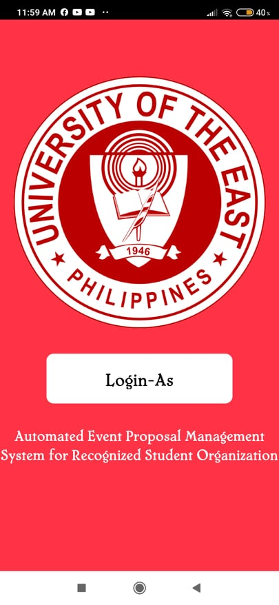
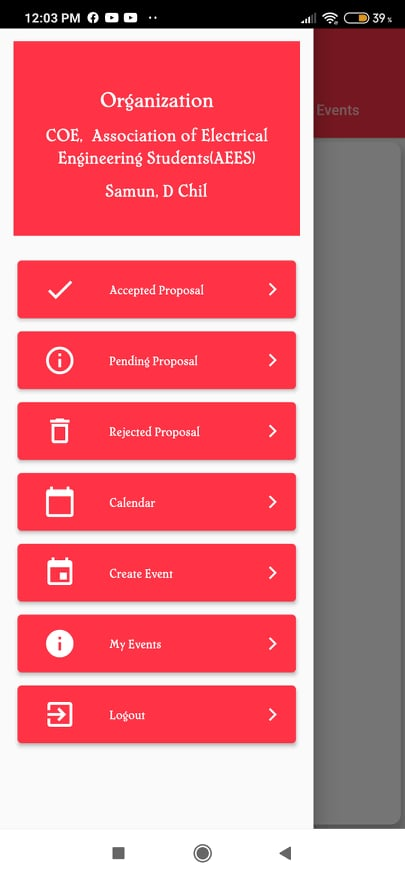

# Event Proposal UE

<b>Event Proposal is a University app where the students can book a paperless event inside the campus. </b>
<b>
Login Screen
</b>
  

  
<b>
Choose Screen
</b>
  

  
<b>
SAO Home
</b>
  
<b>
In this screen all of the events coming from the students is been monitored by the admin
</b>
  

  
<b>
Organization Screen
</b>
  
<b>
In this screen all of the request event is required to be approved by its own organization.
</b>
  

  
<b>
Create event screen
</b>
  
<b>
This screen will be the creation of event, it has Name of the project, Nature of the Project, General Objectives, time of the event.
</b>
  

  
<b>
My event screen
</b>
  
<b>
This screen will be the students created event it will notify when one of the approver accept their requested schedule of event.
</b>
  

  
<b>
Organization screen
</b>
  
<b>
This screen is the example of the approver where all of the particular organization will show according to it's academic colleague.
</b>
  

  

